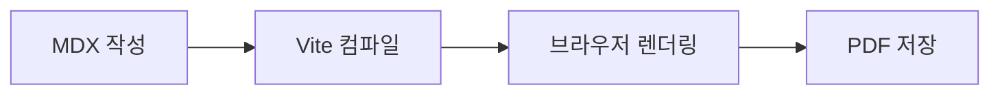

import { KPISection } from '@/components/widgets/KPISection'
import { ChartSection } from '@/components/widgets/ChartSection'
import { QRCode } from '@/components/widgets/QRCode'

<DocPage>

## 시각화 요소

MDX 파일 안에 React 컴포넌트를 직접 삽입해 다양한 시각 요소를 표현할 수 있습니다.

### KPI 카드

`<KPISection />` 컴포넌트로 핵심 지표를 강조합니다.

<KPISection
  items={[
    { label: '지원 언어', value: 'TS', unit: '' },
    { label: '출력 형식', value: 'A4', unit: 'PDF' },
    { label: '페이지 제한', value: '없음', unit: '' },
  ]}
/>

### 콜아웃 블록

`:::note`, `:::warning`, `:::tip`, `:::important` 문법을 사용합니다.

:::note
일반 참고 사항을 작성할 때 사용합니다.
:::

:::important
반드시 확인해야 하는 중요 내용을 강조할 때 사용합니다.
:::

</DocPage>

<DocPage>

## 차트 · 다이어그램

### 꺾은선 차트

`<ChartSection />` 컴포넌트에 데이터 배열을 전달합니다.

<ChartSection
  title="월별 문서 생성 건수"
  data={[
    { name: '1월', value: 13 },
    { name: '2월', value: 19 },
    { name: '3월', value: 28 },
    { name: '4월', value: 35 },
    { name: '5월', value: 41 },
    { name: '6월', value: 58 },
  ]}
/>

### Mermaid 다이어그램

코드 블록의 언어를 `mermaid`로 지정합니다.



</DocPage>

<DocPage>

## 수식 · 코드 · QR

### 수식 (MathJax)

인라인: `$수식$`, 블록: `$$수식$$` 문법을 사용합니다.

**인라인 수식**

$f(x) = ax^2 + bx$

**블록 수식**

$$
\bar{x} = \frac{1}{n} \sum_{i=1}^{n} x_i
$$

### 코드 블록

언어 이름을 지정하면 Shiki로 자동 하이라이팅됩니다.

```typescript
import Content from './my-book/index.mdx'

export default function App() {
  return <Content />
}
```

### QR 코드

`<QRCode />` 컴포넌트로 링크를 QR 코드로 삽입합니다.

<QRCode
  value="https://github.com/devinhyeok/js-printer"
  caption="GitHub 저장소"
/>

</DocPage>
