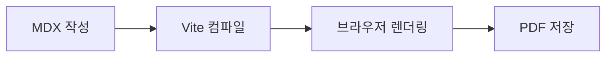

import { QRCode } from '@/components/widgets/QRCode'

<DocPage>

### Mermaid 다이어그램

코드 블록의 언어를 `mermaid`로 지정하면 자동으로 다이어그램이 렌더링됩니다.



````md

````

</DocPage>

<DocPage>

### 수식 (MathJax)

#### 인라인 수식

`$...$` 문법으로 텍스트 중간에 수식을 삽입합니다.

피타고라스 정리는 $a^2 + b^2 = c^2$ 이며, 에너지 공식은 $E = mc^2$ 입니다.

```latex
이차방정식의 근의 공식은 $x = \frac{-b \pm \sqrt{b^2 - 4ac}}{2a}$ 입니다.
```

#### 블록 수식

`$$...$$` 문법으로 독립된 수식 블록을 삽입합니다.

$$
a^2 + b^2 = c^2
$$

```latex
$$
\bar{x} = \frac{1}{n} \sum_{i=1}^{n} x_i
$$
```

</DocPage>

<DocPage>

### 코드 블록

언어를 지정하면 Shiki로 자동 구문 강조가 적용됩니다.

```ts
import type { CatalogItem } from '../catalog-types'

export const catalog: CatalogItem[] = [
  { id: 'my-book', label: '내 문서' },
  {
    folder: '프로젝트',
    children: [
      { id: 'project-a', label: '프로젝트 A 보고서' },
      { id: 'project-b', label: '프로젝트 B 보고서' },
    ],
  },
]
```

````md
```ts
import type { CatalogItem } from '../catalog-types'

export const catalog: CatalogItem[] = [{ id: 'my-book', label: '내 문서' }]
```
````

</DocPage>

<DocPage>

### QR 코드

`<QRCode />` 컴포넌트로 URL을 QR 코드로 삽입합니다.

<QRCode value="https://github.com" caption="GitHub" />

```ts
import { QRCode } from '@/components/widgets/QRCode';

<QRCode value="https://github.com" size={128} caption="GitHub" />
```

:::tip
QR 코드는 PDF 출력 시에도 선명하게 인쇄됩니다. `size` prop으로 크기를 조절할 수 있습니다 (기본값 128px).
:::

</DocPage>
